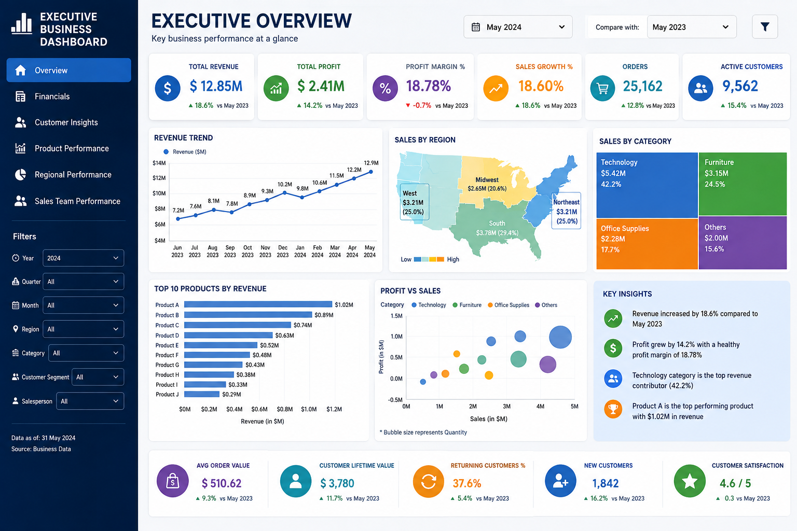

# Executive-Business-Dashboard
Executive Business Dashboard built in Power BI featuring KPI cards, revenue and profit analysis, regional and category insights, top-performing products, interactive filters, and drill-down capabilities. Designed using DAX, Power Query, and a star schema data model to support executive decision-making.
# DAX Measures
Total Sales = SUM(Sales[Sales])

Total Profit = SUM(Sales[Profit])

Profit Margin =
DIVIDE([Total Profit],[Total Sales])

Orders =
DISTINCTCOUNT(Sales[Order ID])

Customers =
DISTINCTCOUNT(Sales[Customer ID])

Average Order Value =
DIVIDE([Total Sales],[Orders])

Sales LY =
CALCULATE(
    [Total Sales],
    SAMEPERIODLASTYEAR(Calendar[Date])
)

Sales Growth % =
DIVIDE(
    [Total Sales]-[Sales LY],
    [Sales LY]
)

Target Achievement % =
DIVIDE([Total Sales],[Sales Target])

Average Profit =
AVERAGE(Sales[Profit])

Top Product Rank =
RANKX(
    ALL(Products[Product]),
    [Total Sales]
)

## Dashboard Preview

